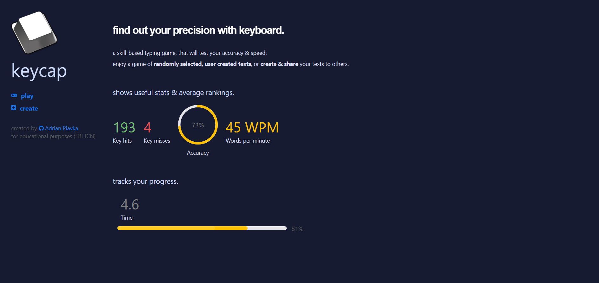
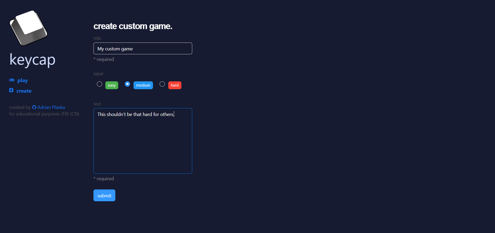
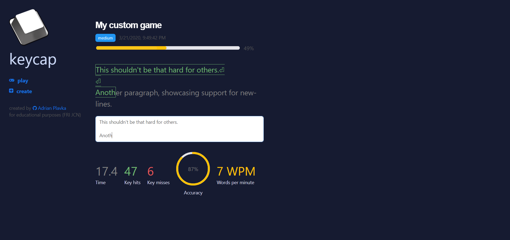
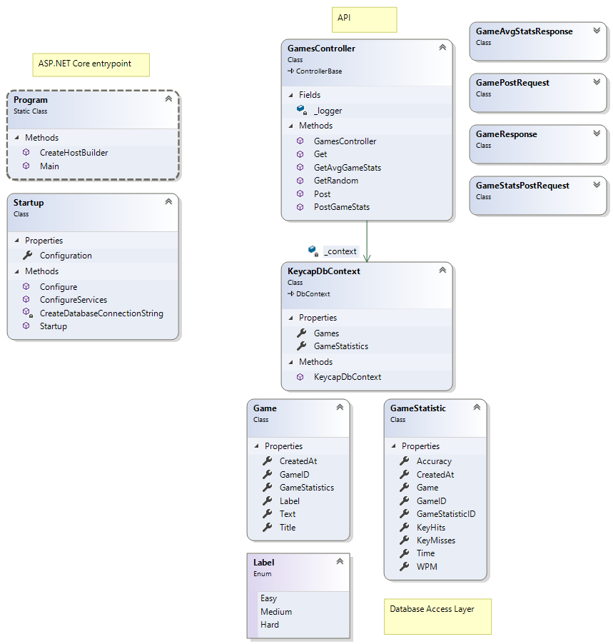

# Keycap

A skill-based typing game, that will test your accuracy & speed. Written in ASP.NET Core & React for educational purposes at my university.

## Overview

An application, that allows users to create their own custom game, setting labels & text, that can be typed out by other users by sharing a link.

The game can be then played by typing the created text into an text area, that is then checked for precision. It is also outputting several informative statistics (like accuracy, key hits & words per minute).

The statistics are gathered per-game basis, where it shows an average run of other clients aswell.

## Used technologies

The communication between a client & a server had to be established. For back-end, a C# ASP.NET Core application has been used, with support for Web API, using annotation-based configuration. When appropriate, I tried to use async support for nearly everything, mainly for accessing the database. The choice for a main database was PostgreSQL, which was configured with Entity Framework.

The client has been written in React, as it was my main front-end client-side library for some quite time. As the game was very reactive, it really helped to create a fast & responsive game.

When developing, I used Visual Studio 2019, with it's flawless debugging support, it helped me maintain code stability. It also helped me generate this project from a template, which has configured all the necessary things for external client support.

Docker has been also used to package this application - Visual Studio helped me to generate a base image, which I then altered for my needs. This has yet proven to me as the best solution for spinning the application fast for others.

## Application requirements

- Visual Studio (preferable version 2019)
- Docker (with `docker-compose` installed aswell)
- .NET Framework

### Building & running using Docker

After residing in a directory with the source code, you should see a `docker-compose.yml` file. This file was written so that it can spin up necessary external services for it to work. There is no need for any other configuration, except running these commands:

- `docker-compose build` (this will build the image from Dockerfile)
- `docker-compose up` (this will run the application with it's database)

After this, the application should be up & running at `http://localhost:5000`.

### Building & running using Visual Studio

The application was being developed using Visual Studio and so it has configured running tasks. Although the application can be run through this, there are several things that have to be set-up first:

- Using Visual Studio, you will have to specify a `DATABASE_URL` environment variable to the currently running task. This will have to point to a PostgreSQL database (example: `postgres://postgres@db:5432/keycap`)
- You will have run a PostgreSQL database itself. For local development, you can use the `docker-compose.yml` file to spin up the database only, using command `docker-compose up db`.
- Now you can run the application using `IIS Express` run task. This will automatically open a browser with the client application.

## UML diagram

Backend is structured as shown in this class diagram:

## Client usage

When entering the site for the first time by navigating the link, you will be greeted with a dashboard, that showcases what the application can do. The left side-bar of the web application is used for navigating into different sections.

The first section is `create`, which will allow you to create a custom game using a form. You can specify a title, label & a text, that will be displayed when played. Note, that in order to play a game, you have to create some game! Otherwise, you will receive UI errors, displaying that games do not exist yet (as the database is empty).

The second sections is `play`, which will fetch a random game from the database everytime the navigation is clicked. This will display all of it's information about the game and the statistics.
You can start the game by typing the right words from the text into the designated textarea - the game will start automatically after that. If you clear the textarea, you will stop the timer and the game will restart anytime you start typing again.

When you hit the keys, you can see the statistics being updated accordingly, showcasing the progress bar, timer and key hits.

After successfully typing out the correct words to the textarea, it will disable itself automatically, outputting your final score. Under the final score, the average stats will also display automatically, also showcasing the results from other users.

You can start a different game by clicking on `play` once again, iterating over random games.

## Developer's thoughts

### Problems & solutions

I have been creating back-end solutions for quite some time, so initially I knew what to look for. I was interested in finding a database framework, that I could design by using code-first approach. As I was a little-bit experienced in the C# ecosystem, I knew about the Entity Framework and so it became my initial focus.

Designing a database using annotations in classes has been familiar to me, as I have been using it in other projects aswell. What I didn't know is how the dependency injection works in ASP.NET projects. I was confused by my database not creating, as I've registered it to the dependency container. Little did I know, the database would not automatically create itself just by declaring it in the container - I would have to inject the database into some class first. This seemed a bit strange to me, so the workaround was to get the database context from the container itself at the startup of the application & regenerate the database anew, deleting the contents of the database anytime the application has started.

Initially I was interested in creating the client in `Blazor`, but the syntax proved to be really weird to me, deciding that a familiar approach with React would be much better.

After this, I was quite satisfied and confident that I could spin this application on some cloud service. I used `Heroku` as my main platform, as I have other project running there. `Heroku` provides add-ons, that you can plug into your projects & use them - one of the add-ons is PostgreSQL, that had a free-tier.

Unfortunately, I couldn't connect the application and the external database together, as it had problem with re-creating the database anytime the application started. It would throw an error, showing that the user connecting to the database doesn't have sufficient rights. The first thought was that I have been passing the database credentials wrong, but after many trials and errors, I have decided to focus on the application itself.

For this application to be started without installing anything on a different computer, I focused to create a Docker image from this application. To optimalize the build times of the image, I made sure to write the steps of the Dockerfile in correct steps, as to leverage the caching capabilities of the Docker (it caches previous steps if nothing has changed, by checking the checksum of the step).

I was surprised by the OpenAPI support from the `Swashbuckle` library and it looked more promising than other library from the `Spring` framework, existing in JVM ecosystem.

Besides the Entity Framework issues, the whole development was quite a breeze and I am glad that I could spend time on a different platform, giving me a potentially useful tool to use in some other project.

### Final words

The application is not by all means safe, as it doesn't leverage any security issues whatsoever. The first improvement would be to create some kind of throttling capabilities into the application, as the endpoints are easily visible. An experienced developer could overflow the database by creating many requests to create games or post fake statistics.

The second issue is that there is no client validation & we trust the client with the statistics he made. Initially I was interested in WebSocket support, but I decided to not make the project any complex. I was more interested in how ASP.NET configures itself and how is the development experience.

Overall, this project proved to me, that C# ecosystem is vast and by some degree, better than the ecosystems I have been using across my projects (for example, Node.js is quite behind in some things).
